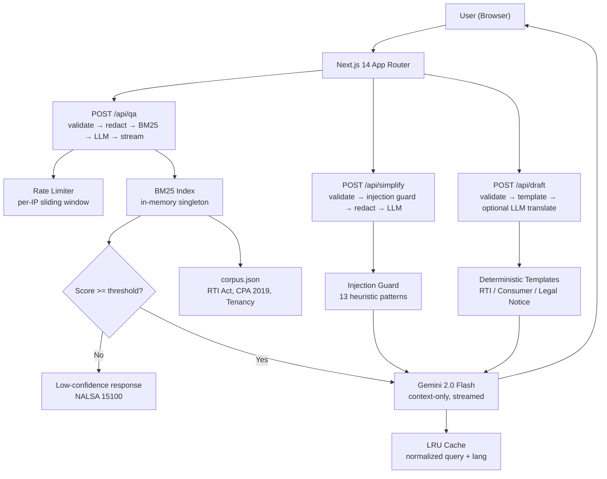

# ⚖️ NyayaSaathi — Free Legal Help for Every Indian

[](https://github.com/YOUR_USERNAME/nyayasaathi/actions)
[](https://opensource.org/licenses/MIT)
[](./tests)

> **न्याय** (Nyaya) = Justice · **साथी** (Saathi) = Companion

**Live demo:** [nyayasaathi.vercel.app](https://nyayasaathi.vercel.app) *(no login required)*

---

## The Problem

Over 300 million people in India cannot afford a lawyer. Legal language is inaccessible, forms are confusing, and free aid services are hard to find. When someone receives an eviction notice, gets a defective product, or wants to file an RTI, they often have nowhere to turn.

NyayaSaathi bridges this gap — it provides cited, plain-language legal information in English, Hindi, and Marathi, powered by AI, grounded in official government sources.

**Who it helps:** First-generation litigants, rural citizens, consumers, tenants, government employees filing RTI requests, anyone who needs to understand a legal document before signing it.

---

## Features

| Feature | Problem It Solves |
|---------|------------------|
| **Cited Q&A** | "What is the RTI reply deadline?" — answered with Act + Section citation |
| **Document Simplifier** | Upload a rental agreement → get plain-language summary + red flags |
| **Document Drafter** | Step-by-step RTI, consumer complaint, and legal notice generator |
| **Free Legal Aid Finder** | NALSA helplines, State authorities, eDaakhil portal, lawyer checklist |

All features work in **English, Hindi, and Marathi**. Voice input and read-aloud supported.

---

## Architecture



### Request Flow (Q&A)

1. User submits question (text or voice)
2. Zod validation — max 1000 chars, language check
3. PII redaction — Aadhaar, PAN, phone, email, UPI stripped
4. LRU cache lookup (normalized query + language)
5. BM25 retrieval — top-4 chunks from in-memory index
6. Confidence check — if score < 1.0, return "not sure" + NALSA pointer (NO LLM call)
7. Gemini 2.0 Flash — context-only system prompt, streaming
8. Streamed token-by-token with sources encoded in response headers

---

## Tech Stack

| Layer | Technology | Why |
|-------|-----------|-----|
| Framework | Next.js 14 App Router | SSR, API routes, streaming |
| Language | TypeScript strict mode | Type safety throughout |
| Styling | Tailwind CSS | Fast, accessible UI |
| LLM | Google Gemini 2.0 Flash | Free tier, fast, multilingual |
| Retrieval | Custom BM25 (in-memory) | Zero infra cost, instant cold start |
| Validation | Zod | Runtime type-safety on all API inputs |
| Testing | Vitest + React Testing Library | ESM-native, fast |
| CI | GitHub Actions | lint + typecheck + test + build |

---

## Setup & Run

### Prerequisites
- Node.js 20+
- Free Gemini API key: [makersuite.google.com/app/apikey](https://makersuite.google.com/app/apikey)

```bash
git clone https://github.com/YOUR_USERNAME/nyayasaathi.git
cd nyayasaathi
npm install
cp .env.example .env.local
# Add GEMINI_API_KEY to .env.local
npm run dev
# Open http://localhost:3000
```

### Verify all checks pass

```bash
npm run lint        # ESLint (0 warnings allowed)
npm run typecheck   # TypeScript strict mode
npm test            # 104 tests
npm run build       # Production build
```

---

## Environment Variables

| Variable | Required | Default | Description |
|----------|----------|---------|-------------|
| `GEMINI_API_KEY` | **Yes** | — | Google Gemini API key |
| `GEMINI_MODEL` | No | `gemini-2.0-flash` | Override model name |
| `RATE_LIMIT_WINDOW_MS` | No | `60000` | Rate limit window (ms) |
| `RATE_LIMIT_MAX_REQUESTS` | No | `20` | Max requests per window per IP |
| `DAILY_CAP_PER_IP` | No | `200` | Daily request cap per IP |

Never commit `.env.local` — only `.env.example` is in the repo.

---

## Project Structure

```
nyayasaathi/
├── app/
│   ├── api/qa/route.ts         # Cited Q&A streaming endpoint
│   ├── api/simplify/route.ts   # Document simplification endpoint
│   ├── api/draft/route.ts      # Document draft generation endpoint
│   ├── qa/page.tsx             # Q&A feature page
│   ├── simplify/page.tsx       # Document simplifier page
│   ├── draft/page.tsx          # Document drafter page
│   └── legal-aid/page.tsx      # Free legal help finder
├── lib/
│   ├── llm/                    # LLMProvider interface, Gemini impl, prompts, retry
│   ├── rag/                    # BM25 index, retrieve(), confidence threshold
│   ├── security/               # redact, sanitize, rateLimit, validators, injectionGuard
│   ├── drafting/               # Document templates + Zod field schemas
│   ├── i18n/                   # UI strings (en/hi/mr)
│   └── cache.ts                # LRU cache with TTL
├── data/
│   ├── corpus.json             # Legal corpus (13 chunks: RTI, CPA, Tenancy)
│   ├── legal-aid.json          # Free legal aid contacts
│   └── README.md               # Corpus verification guide
├── tests/                      # 104 unit + integration tests
└── .github/workflows/ci.yml    # CI: lint, typecheck, test, build
```

---

## Testing

```bash
npm test            # All 104 tests
npm run test:watch  # Watch mode
```

| Test File | Coverage |
|-----------|---------|
| `retrieval.test.ts` | Known RTI/CPA/Tenancy queries hit correct chunks; low-confidence returns no chunks |
| `redact.test.ts` | Aadhaar/PAN/phone/email/UPI redacted; dates/amounts not affected |
| `validators.test.ts` | All input schemas; file upload MIME/extension/magic-byte checks |
| `injectionGuard.test.ts` | 6 attack patterns flagged; safe legal text passes |
| `rateLimit.test.ts` | Window limit, per-IP tracking, window reset |
| `cache.test.ts` | LRU eviction, TTL expiry, key normalization |
| `drafting.test.ts` | All 3 templates produce required content; Zod schemas reject invalid input |
| `bm25.test.ts` | Scoring, sorting, Devanagari tokenization |
| `api.test.ts` | All routes: 400s, streaming 200s, injection block, low-confidence path |

---

## Security

- **No secrets in repo** — `.env.example` only; server fails fast with a friendly error if key is missing
- **Server-side Zod validation** on every route — strict max lengths, unknown fields rejected
- **PII redaction** — Aadhaar, PAN, phone, email, UPI stripped before any LLM call; raw input never logged
- **Prompt injection guard** — document text wrapped in `<DOCUMENT_DATA_START>` tags; 13 heuristic patterns detected
- **Rate limiting** — per-IP sliding window in-memory (replace with Redis/Upstash for multi-instance production)
- **Security headers** — CSP, X-Content-Type-Options, X-Frame-Options, Referrer-Policy, Permissions-Policy (microphone for self)
- **LLM output safety** — rendered as text, never `dangerouslySetInnerHTML` with raw model output
- **Upload handling** — processed in memory only, never persisted; MIME + extension + magic-byte validation
- **Timeouts & retries** — 25s timeout, exponential backoff (3 retries), errors never leak internals

---

## Accessibility

Target: Lighthouse Accessibility >= 95

- Semantic HTML landmarks, skip-to-content link
- Visible focus rings (3px solid, all interactive elements)
- ARIA live regions for streaming answers and errors
- `lang` attribute updated on language switch (hi-IN, mr-IN, en-IN)
- WCAG AA contrast ratios
- Font-size controls (A- / A / A+) via CSS variable
- High-contrast toggle, `prefers-reduced-motion` respected
- Voice input (Web Speech API) with fallback message
- Read-aloud (SpeechSynthesis) with Indian language voices
- All inputs have labels, no color-only meaning
- Mobile-first responsive layout

Lighthouse scores (fill after deployment):
- Performance: ___
- Accessibility: ___
- Best Practices: ___
- SEO: ___

---

## Efficiency Decisions

- BM25 index built once at startup (singleton), reused across all requests
- LRU cache for repeated Q&A — 5 min TTL, 100 entries
- Streaming responses token-by-token via ReadableStream
- Low-confidence short-circuit — no LLM call when BM25 scores below threshold
- top-k = 4 chunks — minimal context window usage
- No vector database — BM25 is fast, zero infrastructure
- Static generation for legal-aid page (no runtime data fetch)
- In-memory upload processing — no disk I/O

---

## Responsible AI & Limitations

**Not legal advice** — every response includes: "This is general legal information, not legal advice. For your specific situation, please consult a qualified lawyer or free legal aid service."

**Corpus verification status** — all 13 corpus chunks have `"verified": false`. The text is written as accurate paraphrases from official government sources (indiacode.nic.in, consumeraffairs.nic.in) but has not been independently reviewed by a qualified lawyer. See `data/README.md` for the verification guide.

**PII handling** — user text is redacted before the LLM, raw input is never logged, uploaded documents are not stored.

**Language quality** — Hindi and Marathi responses are LLM-generated. Verify critical legal terminology with a domain expert.

**Out-of-scope refusals** — the model is instructed to refuse criminal defence strategy, advice on evading the law, and harmful requests.

---

## Deployment (Vercel)

1. Push to GitHub
2. Connect to Vercel
3. Set `GEMINI_API_KEY` environment variable
4. Deploy

**Post-deployment QA checklist:**
- [ ] App loads without login
- [ ] "How do I file an RTI?" streams an answer with citation
- [ ] Nonsense query shows "not sure" + NALSA 15100
- [ ] Hindi language switch works — answer in Hindi
- [ ] Document simplifier works with pasted text
- [ ] Draft RTI — preview shows correctly, Print/PDF works
- [ ] Legal aid page shows NALSA 15100
- [ ] Mobile layout correct on Chrome + Safari
- [ ] Verify NALSA 15100 is reachable
- [ ] Verify edaakhil.nic.in is live

**Things to verify before production:**
1. Corpus — have a lawyer review `data/corpus.json` and set `"verified": true`
2. NALSA 15100 — call to confirm active
3. All URLs in `data/legal-aid.json` — check each one
4. Consumer helpline numbers 1800-11-4000 and 14404
5. Run Lighthouse audit and fill in scores above

---

## Roadmap

- [ ] Lawyer review and verify corpus chunks
- [ ] Add Labour Law (PF, ESI, minimum wage) corpus
- [ ] Add Domestic Violence Act 2005
- [ ] Punjabi and Tamil language support
- [ ] Replace in-memory rate limiter with Upstash Redis
- [ ] Screen reader accessibility audit
- [ ] District court locator integration

---

## License

MIT © 2024 NyayaSaathi Contributors. Built for the AI for Legal Assistance & Access hackathon.

*NyayaSaathi is not a law firm and does not provide legal advice.*
