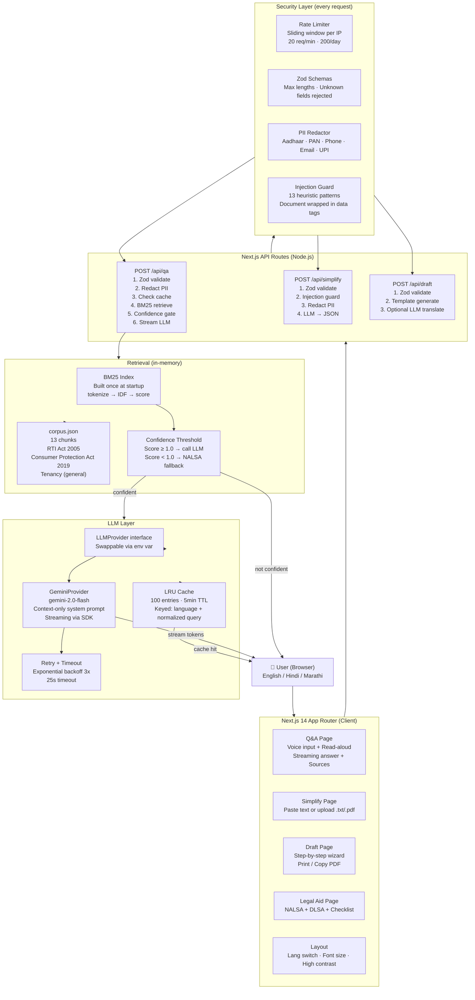

# NyayaSaathi — Architecture

## Mermaid Diagram



## Data Flow — Q&A Request

```
Browser
  │ POST /api/qa { question, language }
  ▼
Rate Limiter (per-IP sliding window)
  │ allowed?
  ▼
Zod Validation (question ≤ 1000 chars, language ∈ {en,hi,mr})
  │ valid?
  ▼
PII Redactor (Aadhaar, PAN, phone, email, UPI → placeholders)
  │ clean query
  ▼
LRU Cache Lookup (normalized query + language)
  │ miss
  ▼
BM25 Index Search (top-4 chunks from 13-chunk corpus)
  │ best score
  ▼
Confidence Gate
  ├─ score < 1.0 → stream "I'm not sure + NALSA 15100" (NO LLM call)
  └─ score ≥ 1.0 → build context from top-k chunks
                      │
                      ▼
                   Gemini 2.0 Flash (system prompt: context-only, cite sources)
                      │ streaming tokens
                      ▼
                   Stream to browser (ReadableStream)
                   Sources encoded in X-Sources header (URL-encoded JSON)
                   Cache full response on completion
```

## Key Design Decisions

| Decision | Rationale |
|----------|-----------|
| BM25 over vector DB | Zero infrastructure cost, no cold start, instant lookup, sufficient for small corpus |
| Confidence threshold before LLM | Prevents hallucination on out-of-corpus queries; saves API quota |
| PII redaction before LLM | Privacy-first; Aadhaar/PAN never leave the server unredacted |
| Deterministic templates | Drafts are always factually correct; LLM only translates/polishes |
| Injection guard + data tags | Documents are untrusted; prevent prompt injection from user content |
| In-memory rate limiter | Simple, zero-dependency; documented Redis upgrade path for production |
| LRU cache | Repeated common questions (RTI deadline, consumer rights) served instantly |
| Streaming responses | Better UX — user sees answer tokens as they arrive |
| No database | Corpus is static JSON; zero infra to manage or pay for |
